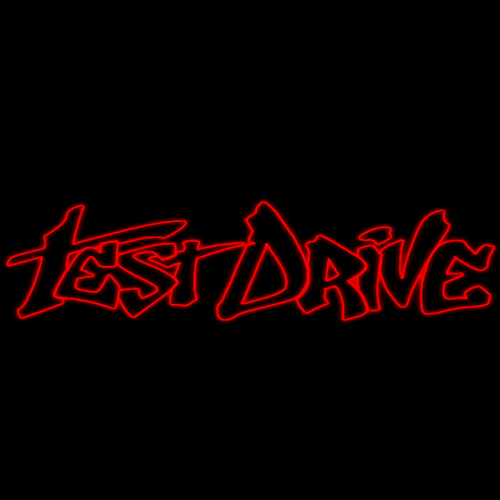

# Test Drive Pong Remake

## Purpose:

This program is a remake of the loading screen from the racing videogame [Test Drive](https://en.wikipedia.org/wiki/TD_Overdrive:_The_Brotherhood_of_Speed) on the PlayStation 2. 

This project was created for an assignment, and is released with permission of the instructor. 

## Setup: 

1) Clone this repo in Visual Studio.

### Import music:

The song on this repo is a blank 1 minute wav file. To put in your own music, follow these directions:

1) Ensure the audio is in wav format and the filename is `song.wav`.
2) Open `\Properties\Resources.resx`.
3) Navigate to the `Audio` category.
4) Drag and drop the new `song.wav` into the managed resources editor. Select `yes` when asked if you want to replace the resource.

The song that plays on the title screen is [Ugly by Bubba Sparxxx](https://www.youtube.com/watch?v=OfaGEJMSEwc).

## Contributing:

Please do not include copyrighted material in your pull request!

## License:

This project is licensed under [The 3-Clause BSD License](https://opensource.org/license/bsd-3-clause).